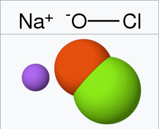

# Oxidizers

# Solvents

# Bases
#### Potassium Hydroxide
#### Sodium Hydroxide
### Alkaline
- An alkali is a basic, ionic salt of an alkali or alkaline earth metal
#### Sodium Hypochlorite
- Bleach

# Acids

---
## Surfectants?

## Emulsifiers?

