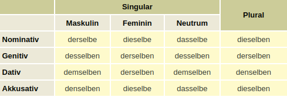

# Worte/Wörter
- [unmittelbare Bedeutung hier](https://www.pcs-campus.de/praxis/texten/woerter-oder-worte/#:~:text=Bei%20der%20Frage%2C%20wann%20man,Worte%20bestehen%20somit%20aus%20W%C3%B6rtern.)
## derselb-
- [Link hier](https://www.deutschplus.net/pages/Demonstrativpronomen_derselbe#:~:text=Das%20Demonstrativpronomen%20derselbe%2C%20dieselbe%2C%20dasselbe%20ist%20synonym%20mit%20der%20gleiche,man%20sie%20nicht%20synonym%20gebrauchen.)

